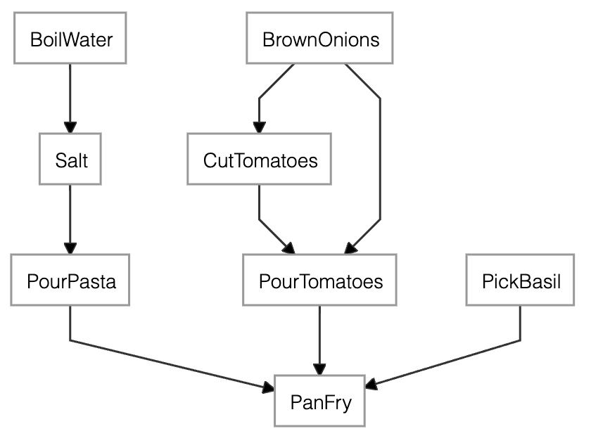
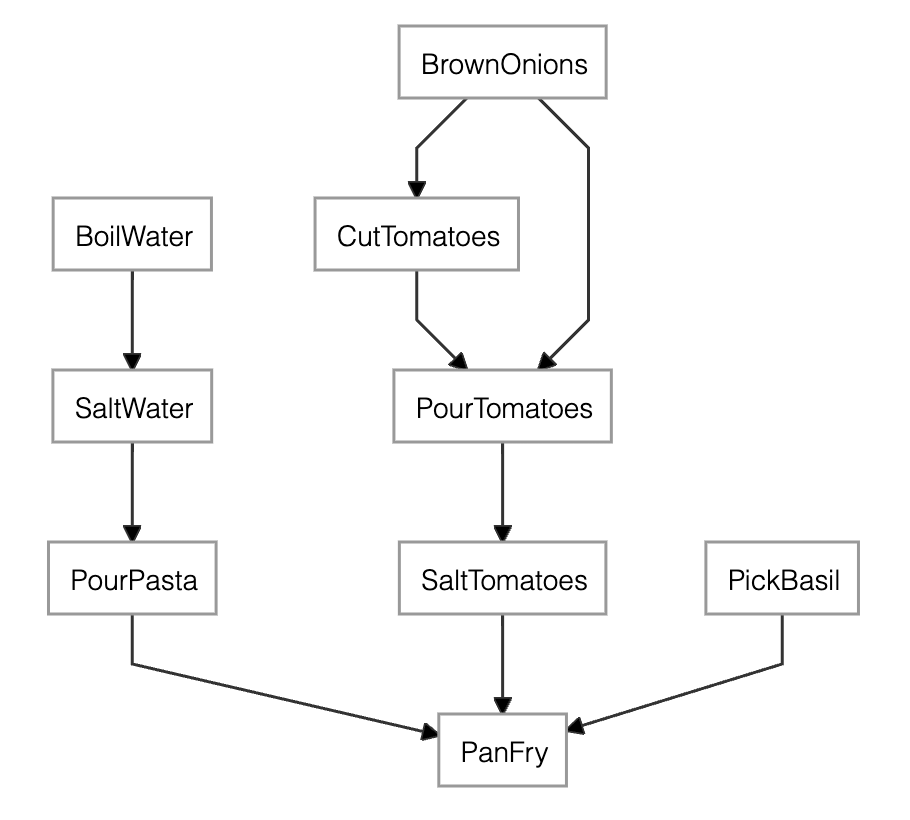

# Orchestra
Orchestra is a pipeline orchestration framework designed for data science workflows.

## Quick start

In Orchestra, you define any pipeline as a direct acyclic graph of Steps.

### Declare the pipeline steps and their dependencies

Here is the recipe for a *pasta al pomodoro e basilico* as a sequence of steps. If a `Step` requires the completion of another one first, it is declared in the constructor argument `depends_on`.
```python
water = BoilWater()
brown_onions = BrownOnions()
cut_tomatoes = CutTomatoes(depends_on=brown_onions)
pour_tomatoes = PourTomatoes(depends_on=[cut_tomatoes, brown_onions])
salt = Salt(depends_on=water)
pasta = PourPasta(depends_on=salt)
basil = PickBasil()
merge = PanFry(depends_on=[pasta, pour_tomatoes, basil])
```
The pipeline always ends with a final `Step` (in this case, PanFry) that is the head of the pipeline.
<center>

</center>

<center>

*The dependency graph of the pasta recipe generated by `merge.dependency_graph()`*

</center>


### Implement the pipeline steps
The action performed by each `Step` is declared inside the subclass method `run()`. The method receives as many arguments as the dependencies of the Step. 

Here for example, `ingredients` is the list of the ouputs of the steps  `PourPasta`, `PourTomatoes` and `PickBasil`.
```python
class PanFry(Step):
    def run(self, *ingredients):
        pan = pick_pan()
        pan.pour(ingredients)
        pan.blend()
```

### Check the pipeline before execution
- **As an image**: you can check the direct and indirect dependencies of a Step by calling `dependency_graph()`. For example, calling `merge.dependency_graph()` **produces the above image**. 
- **As plain text**: you can inspect the list of Steps that are going to be executed by the pipeline with the subclass method `execution_plan()`. 

    ```
    Execution plan. Result availability: [*] available - [ ] n/a - [x] no context. 
                    Scheduled execution: (H) head - (>) scheduled run on materialize - ( ) no run required.
    [x] (>) BrownOnions
    [x] (>) CutTomatoes
    [x] (>) BoilWater
    [x] (>) Salt
    [x] (>) PickBasil
    [x] (>) PourTomatoes
    [x] (>) PourPasta
    [x] (H) PanFry
    ```

    The plan contains one row for each `Step`. The name of the step is preceded by two symbols whose meaning is explained further down in Section [Memory persistence](#memory-persistency).

Both methods tell which stages are seen by the current head (PanFry) based on the dependencies stated before. If you decide to add one last `Step` to the pipeline, you should use any of `dependency_graph()`, `execution_plan()` or `materialize()` on the new `Step` instead.

### Execute the pipeline
Finally, you execute the recipe with 

```
lunch = merge.materialize()
```

Calling `materialize()` on the last `Step` makes all the dependent steps to be executed in the right order passing the output of a Step to its depending ones. 

## Memory persistency 

Orchestra is a memoryless system by default. But if you'd like to:
- **stop/resume development** - store the state of a pipeline to resume development at a later stage
- **optimize the computation** - save the result of one or many intermediate `Step`s to avoid recomputing it whenever needed

you can create a `Context` object, and pass it to whatever `Step` you like. The ouptput of that `Step` will available in the `Context` for any depending `Step`.

For example, let's consider the previous recipe and add a `Context` to PourTomatoes.
```python
ctx = Context()
pour_tomatoes = PourTomatoes(depends_on=[cut_tomatoes, brown_onions], ctx=ctx)
merge = PanFry(depends_on=[pasta, pour_tomatoes, basil])
merge.execution_plan()
```

```
Execution plan. Result availability: [*] available - [ ] n/a - [x] no context. 
                Scheduled execution: (H) head - (>) scheduled run on materialize - ( ) no run required.
 [x] (>) BrownOnions
 [x] (>) CutTomatoes
 [x] (>) BoilWater
 [x] (>) Salt
 [x] (>) PickBasil
 [ ] (>) PourTomatoes
 [x] (>) PourPasta
 [x] (H) PanFry
```

The execution plan shows that PourTomatoes has access to a `Context`, but the result is not yet available (n/a) since we haven't materialized the new PourTomatoes yet. Therefore, all the Steps are still “scheduled to run on materialize".
Let's materialize the recipe and then observe the execution plan once again.
```python
lunch = merge.materialize()
merge.execution_plan()
```

Here is the result:
```
Execution plan. Result availability: [*] available - [ ] n/a - [x] no context. 
                Scheduled execution: (H) head - (>) scheduled run on materialize - ( ) no run required.
 [x] ( ) BrownOnions
 [x] ( ) CutTomatoes
 [x] (>) BoilWater
 [x] (>) Salt
 [x] (>) PickBasil
 [*] ( ) PourTomatoes
 [x] (>) PourPasta
 [x] (H) PanFry
```
This time PourTomatoes is available in the Context, so the next time you call `merge.materialize()`, PourTomatoes and all its dependencies won't be executed again. 

As usual, you can inspect the result of any Step by calling `materialize()` on it. If a `Context` is available for that `Step`, the result will be returned without executing `run()`.

### Load/Store the state of the pipeline
Simply use `ctx.store("path")` and `ct.load("path")` to store and load a `Context` to/from disk. 

As a safety measure, no file or directory named `“path"` must exist already when calling `store()`.

## Reusing pipeline steps

Pipeline steps require to have a unique name. In those situations where you want to re-use the same Step twice or more, you can alias the `Step` name by passing the argument `name_alias` to the constructor of the subclass. For example, we can modify the previous example by adding Salt both to BoilWater and to PourTomatoes:

```python
... 
pour_tomatoes = PourTomatoes(depends_on=[cut_tomatoes, brown_onions])
salt_water = Salt(depends_on=water, name_alias="SaltWater")
salt_tomatoes = Salt(depends_on=pour_tomatoes, name_alias="SaltTomatoes")
pasta = PourPasta(depends_on=salt_water)
merge = PanFry(depends_on=[pasta, salt_tomatoes, basil])
...
```

<center>

</center>

<center>

*The dependency graph of the **salty** pasta recipe generated by `merge.dependency_graph()`*

</center>